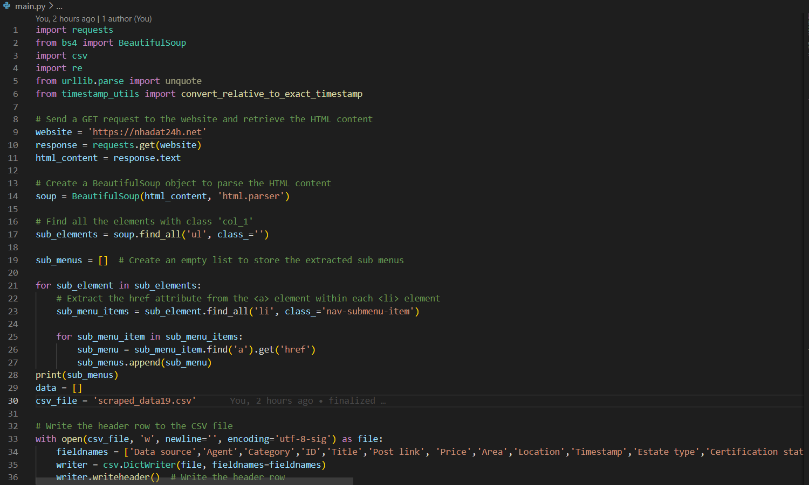

<!-- [![LinkedIn][linkedin-shield]][https://www.linkedin.com/in/uyen276/] -->

 

  

<h3 align="center">Web Scraping Data</h3>

  

    This Python web scraping project aims to extract property information from the website 'https://nhadat24h.net'. The web scraper retrieves data from different sub-menus, saves the scraped information into a CSV file, and downloads property images to a local directory. The project utilizes popular Python libraries such as requests, BeautifulSoup, and csv to achieve its functionality.
     
    <a href="https://github.com/uyenIMT/Web-Scraping-Data#readme"><strong>Explore the project »</strong></a>
     
     
    <a href="https://github.com/uyenIMT/Web-Scraping-Data">View Demo</a>
    ·
    <a href="https://github.com/uyenIMT/Web-Scraping-Data/issues">Report Bug</a>
    ·
    <a href="https://github.com/uyenIMT/Web-Scraping-Data/pulls">Request Feature</a>
  

<!-- TABLE OF CONTENTS -->

  
Table of Contents

  <ol>
    <li>
      <a href="#about-the-project">About The Project</a>
      <ul>
        <li><a href="#built-with">Project Overview</a></li>
        <li><a href="#built-with">Data Extracted</a></li>
        <li><a href="#built-with">Directory structure</a></li>
        <li><a href="#built-with">Used libraries</a></li>
      </ul>
    </li>
    <li><a href="#contributing">Contributing</a></li>
    <li><a href="#contact">Contact</a></li>
    <!-- <li><a href="#acknowledgments">Acknowledgments</a></li> -->
  </ol>

# About the project

  

## Project Overview
This project contains a Python script (main.py) that performs web scraping to gather property data from 'https://nhadat24h.net'. The data includes information such as Data source, Agent, Category, ID, Title,	Post link, Price, Area,	Location, Timestamp, Estate type, Certification status, Direction, Rooms, Bedrooms, Kitchen, Living room, Bathrooms, Front width, Floor, Parking slot, Description, Seller name, Seller type, Phone, Images, Image URL, Email, Road width, Sizes.

The extracted data is stored in a CSV file for easy analysis and further processing. Additionally, the script downloads property images and saves them in a folder, allowing users to view the properties along with their information.

## Data Extracted
The web scraper extracts the following information for each property:

Data source: The website where data is crawled. 
Agent: Who crawls data. 
Category: The category of the property. 
ID: ID of the property. 
Title: The title or name of the property. 
Post Link: The URL link to the property's page on the website. 
Price: The price of the property. 
Area: The area size of the property. 
Location: The location of the property. 
Timestamp: The timestamp of when the property was listed or updated. 
Estate type: The specific type of property (Nhà trong ngõ/Biệt thự...). 
Certification status: The legal certification of the property. 
Direction: The facing direction of the property (e.g., North, South, etc.). 
Rooms: The number of room. 
Bedrooms: The number of bedrooms in the property. 
Kitchen: The number of kitchen. 
Living room: The number of living room. 
Bathrooms: The number of bathroom in the property. 
Front width: The measurement of the front width. 
Floor: The number of floors in the property. 
Parking slot: The number of parking slot. 
Description: The description of the owner of the post. 
Seller name: The name of the seller. 
Seller type: Owner or Agency. 
Phone: Phone number of the seller. 
Images: The path to images. 
Image URL: The Image URL. 
Email: Email of the seller. 
Road width: The measurement of the width of the road in front of the property. 
Sizes: width x length. 

## Directory Structure
web-scraping-project/ 
│   README.md 
│   main.py 
│   timestamp_utils.py 
│   clean.py  
│   combine_csv.py  
│   convert_price  
│   download_images.py  
│   extract_location  
│   Cities.csv 

main.py: The main crawler script. 
timestamp_utils.py: The script is used to standardize timestamp. 
clean.py: The script to clean data such as removing duplicate, standardizing data type of columns... 
combine_csv.py: The script is used to combine multiple csv files. 
convert_price: The script is used to convert raw data in the Price column into numeric data. 
download_images.py: The script is used to download images from the links in the Image URL and store them in a folder. 
extract_location: The script is used to extract City and District from the Location column and then store them in two new columns named City and District. 
Cities.csv: The csv is used to map the data in the Location column in extraction City and District. 

## Used libraries
1. requests: This library is used to send HTTP requests to the website and retrieve the HTML content.
2. BeautifulSoup: This library is used for parsing the HTML content and extracting relevant data using various methods like find_all() and find().
3. csv: This library is used to read and write data to the CSV file.
4. os: This library is used to create a directory to store the downloaded images.
5. base64: This library is used to decode base64-encoded images (if applicable).
6. re: This library provides support for regular expressions, which are used to clean and sanitize the property titles.
7. datetime: This library is a built-in Python module that provides classes and functions for working with dates and times. It is used in the convert_relative_to_exact_timestamp function to handle and manipulate datetime objects.
8. pandas: This library is used for data analysis and associated manipulation of tabular data in DataFrames.

# Contributing
Contributions to this project are welcome. If you find any issues or have suggestions for improvement, feel free to open a pull request or submit an issue.

Note: Please be aware that web scraping may be subject to legal and ethical considerations. Ensure that you have the necessary permissions before scraping data from any website. The authors of this project are not responsible for any misuse of the scraper.

# Contact
Uyen NGUYEN - uyenfr.ai@gmail.com

Project Link: [https://github.com/uyenIMT/Web-Scraping-Data](https://github.com/uyenIMT/Web-Scraping-Data)

(<a href="#readme-top">back to top</a>)

